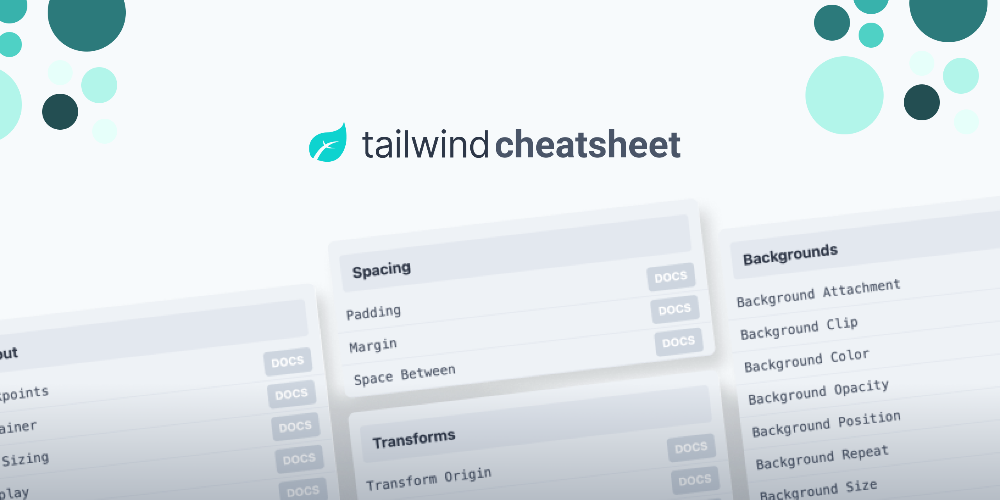

# tailwind-cheatsheet-vue

JSON 数据来自[tailwind-cheatsheet](https://github.com/tailwindcomponents/cheatsheet)



## Project setup

```
pnpm dev
```

### Compiles and hot-reloads for development

```
pnpm start
```

### Compiles and minifies for production

```
pnpm build
```
